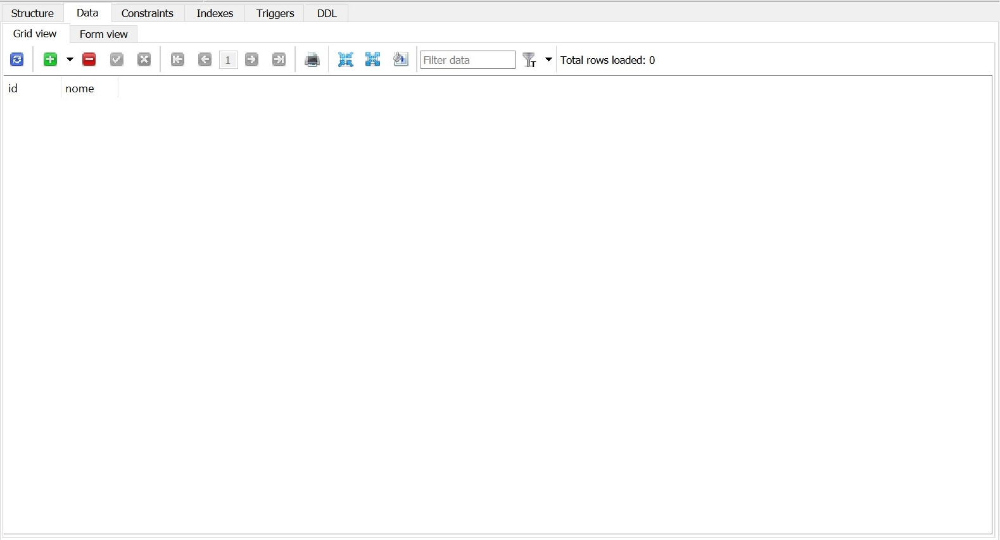
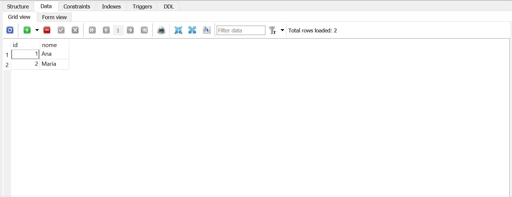
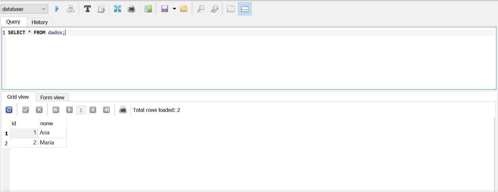
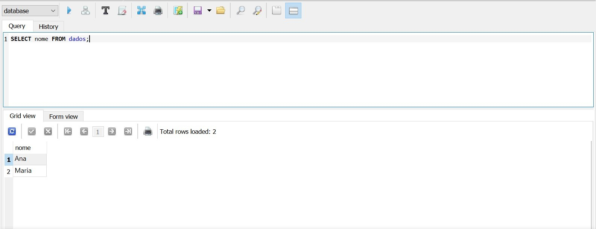
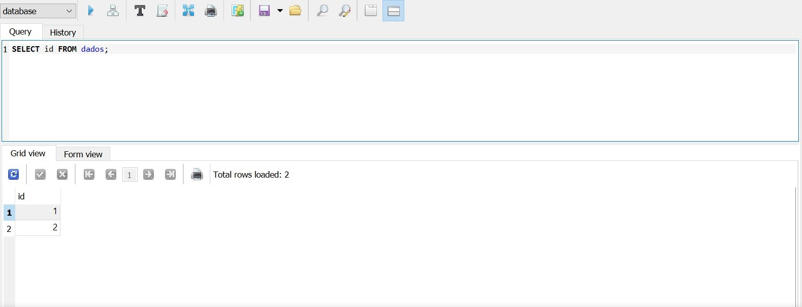
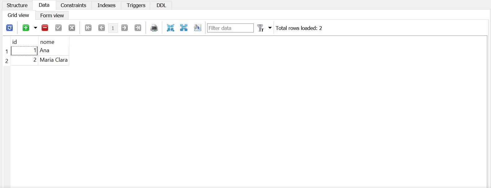
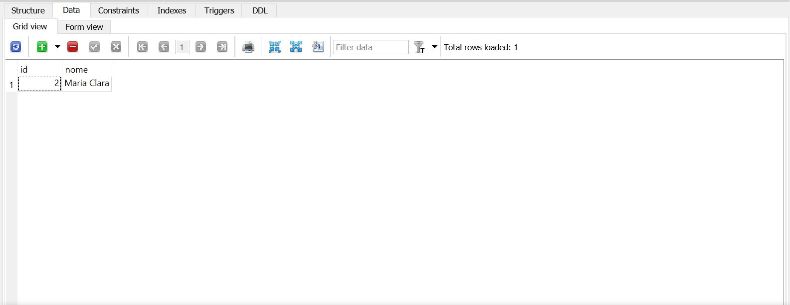

# Banco de Dados com SQLite

<div align="justify"> 
  
  Este tutorial foi preparado para ajudá-lo a entender os conceitos relacionados ao SQLite e ao gerenciamento de dados estruturados em diferentes tipos de aplicação (aplicativos desktop, web e mobile).
 
</div>

---

**Descrição**

<div align="justify">
  
  Este tutorial apresenta os principais conceitos que você precisa saber para começar a usar o [SQLite](https://www.sqlite.org/index.html) de forma fácil e eficaz.  
  
</div>

**Database** 

<div style="display: inline_block">
  
</div></br>

**Software necessário** 

Instalar a versão mais recente do [SQLite](https://www.sqlite.org/index.html)
- [Link para o download](https://www.sqlite.org/download.html)

---

## Manipulando o Banco de Dados

**Criando uma tabela**

Criando uma tabela chamada **dados** com as colunas **id** (do tipo inteiro e sendo a chave primária com autoincremento) e **nome** (contendo letras e números com um tamanho de até 80 caracteres)

````
CREATE TABLE dados (
    id  
      INTEGER      
      PRIMARY KEY AUTOINCREMENT,
    nome 
      VARCHAR (80) 
);
````
</br>

<div align = "center">
  
</div>

</br>

**Inserindo itens**

Inserindo **'Ana'** e **'Maria'** na coluna chamada **nome**

````
INSERT INTO  dados (nome) VALUES ('Ana');
INSERT INTO dados (nome) VALUES ('Maria');
````

**Observação:** Como a coluna **id** está como **PRIMARY KEY AUTOINCREMENT**, o valor é incrementado de 1 (um) em 1 (um) quando um novo item é inserido na coluna **nome**. 

</br>

<div align = "center">
  
</div>

</br>

**Selecionando itens**

Selecionando todos os itens da tabela, tanto da coluna **id** como da coluna **nome** 

````
SELECT * FROM dados;
````
</br>

<div align = "center">
  
</div>

</br>

Selecionando os itens apenas da coluna **nome** 

````
SELECT nome FROM dados;
````
</br>

<div align = "center">
  
</div>

</br>

Selecionando os itens apenas da coluna **id** 

````
SELECT id FROM dados;
````
</br>

<div align = "center">
  
</div>

</br>

**Atualizando itens**

Atualizando o **nome** **Maria** por **Maria Clara** 

````
UPDATE 
  dados
SET 
  nome = 'Maria Clara'
WHERE 
  id = 2;
````
</br>

<div align = "center">
  
</div>

</br>

**Deletando itens**

Deletando a linha da tabela, cujo o **id** é 1.

````
DELETE FROM
    dados
WHERE 
    id = 1;
````
</br>

<div align = "center">
  
</div>

</br>

</br>

**Contato** </br>

Para mais informações ou dúvidas, entre em contato comigo 😉

---

<div> 
  <a href="https://github.com/arianacabral" target="_blank"></a>
  <a href = "mailto:arianacabral57@ufu.br"></a>
  <a href="https://discord.gg/RTXE2NMVSA" target="_blank"></a> 
</div>
